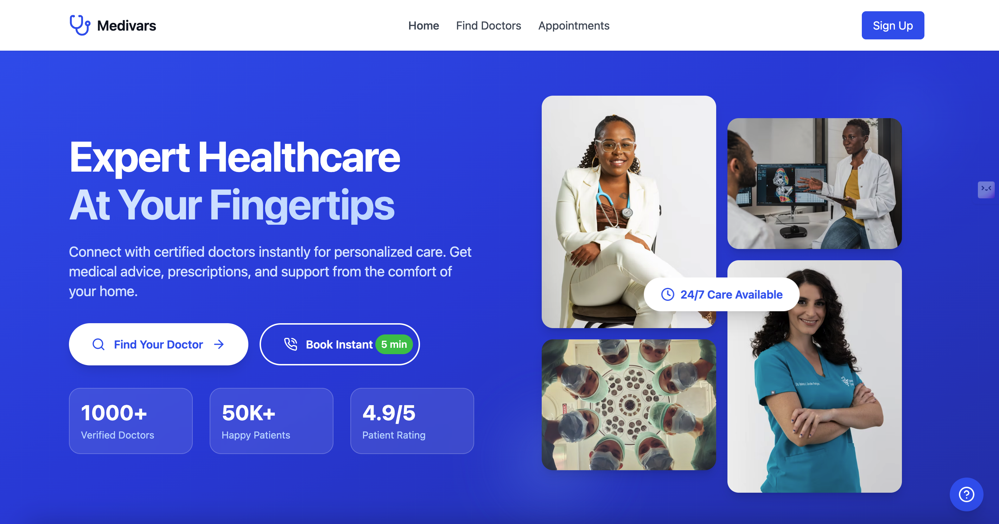

# MediVars - Doctors Consultation Web App



## [Check out the live web app](https://medivars.netlify.app/)

A modern telemedicine platform connecting patients with healthcare providers through video consultations, instant messaging, and online appointment management.

## Features

- **Patient Features**
  - Search and filter doctors by specialty, availability, and rating

  - Choose consultation type: Audio, Video, Chat, In-Visit

  - Schedule appointments with preferred doctors by selecting date and time

  - Instant Booking within 5 minutes based on urgency (Low, Medium, High)

  - Secure payment integration for consultation booking

  - Receive appointment reminders and notifications 

- **Doctor Features**
  - Seamless onboarding process for doctors

  - Manage profile and availability

  - Accept or reject appointments

  - Conduct virtual consultations through audio, video, or chat

  - View patient details before consultations


- **Admin Features**
  - User and doctor management
  - Analytics dashboard
  - Content moderation
  - System configuration

## Technologies Used

- **Frontend**
  - React + TypeScript for building the user interface

  - Vite for fast development and optimized builds

  - Tailwind CSS for modern and responsive UI design

  - React Router for seamless navigation

- **UI Enhancements**
  - Framer Motion for smooth animations

  - React Hot Toast for real-time notifications

  - Date-fns for efficient date and time management

## Installation

1. Clone the repository:
   ```bash
   git clone https://github.com/your-username/medivars.git
   ```
2. Install dependencies:
   ```bash
   npm install
   ```

3. Start development server:
   ```bash
   npm run dev
   ```

## Usage

**Patient Flow:**
1. Register/Login using email or social authentication

2. Search for doctors based on specialty and filters

3. Choose Audio, Video, Chat, or In-Visit consultation

4. Select preferred date and time for booking

5. Securely complete the payment process

6. Attend the scheduled consultation

**Doctor Flow:**
1. Complete onboarding process
2. Set availability schedule
3. Manage appointments
4. Conduct video consultations
5. Update patient records

**Instant Booking Flow:**
1. Select Urgency Level: Low, Medium, High
2. Provide necessary patient details and contact information
3. Get connected to an available doctor within 5 minutes

**Doctor Flow:**
1. Complete seamless onboarding process
2. Set up profile and availability
3. Accept or reject patient bookings
4. Conduct consultations via Audio, Video, or Chat

**Admin Panel:**
1. Approve or reject doctor applications

2. Manage platform users and analytics


**Contributions are welcome! Please follow these steps:**
1. Fork the repository
2. Create your feature branch (`git checkout -b feature/AmazingFeature`)
3. Commit your changes (`git commit -m 'Add some AmazingFeature'`)
4. Push to the branch (`git push origin feature/AmazingFeature`)
5. Open a Pull Request

## License
Distributed under the MIT License. See `LICENSE` for more information.

## Contact
Project Maintainer: [Lahori Venkatesh] - lahorivenkatesh709@gmail.com


## Acknowledgments
- React community

